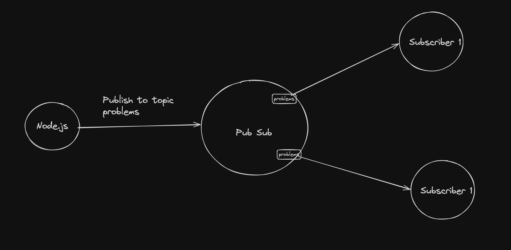
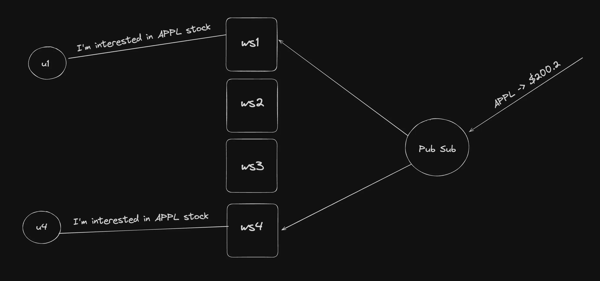

# **Pub Subs**




### Subscribe to a topic
```bash
SUBSCRIBE stocks_channel
```
### Publishing to a topic
```bash
PUBLISH stocks_channel "{id: 1, ans: 'TLE'}"
```

## PubSub Singleton (Basic)
```
export class PubSubManager {
	private static instance: PubSubManager;

	private constructor() {}

	public static getInstance(): PubSubManager {
		if (!PubSubManager.instance) {
			PubSubManager.instance = new PubSubManager();
		}
		return PubSubManager.instance;
	}
}
```
<br>

# **Initialize an empty Typescript Project**
Initialize ```package.json```
```bash
npm init -y
```

Initialize typescript
```bash
npx tsc --init
```

Configure ```tsconfig.json```

```bash
"rootDir": "./src",
"outDir": "./dist",
```
Build typescript project
```bash
tsc -b
```
Run nodejs process
```bash
node dist/index.js
```

<br>

# **Starting redis locally**

Let’s start redis locally and start using it as a DB

```bash
docker run --name my-redis -d -p 6379:6379 redis
```

Connecting to your container

```bash
docker exec -it container_id /bin/bash

# docker exec -it 018wedfabefa367 /bin/bash
```

Connecting to the redis cli

```bash
redis-cli
```

<br>


